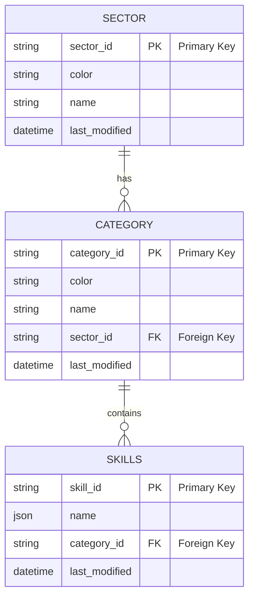

```mermaid
erDiagram
    SECTOR {
        string sector_id PK "Primary Key"
        string color
        string name
        datetime last_modified
    }
    CATEGORY {
        string category_id PK "Primary Key"
        string color
        string name
        string sector_id FK "Foreign Key"
        datetime last_modified
    }
    SKILLS {
        string skill_id PK "Primary Key"
        json name
        string category_id FK "Foreign Key"
        datetime last_modified
    }

    SECTOR ||--o{ CATEGORY : has
    CATEGORY ||--o{ SKILLS : contains
```